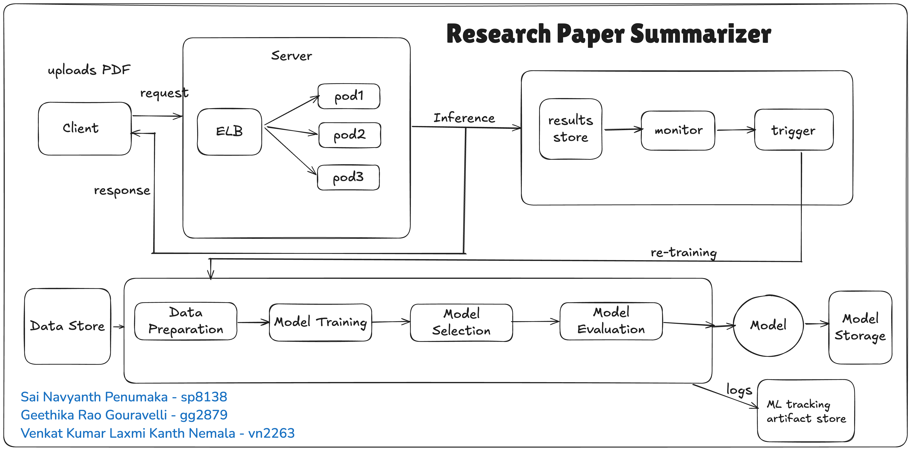

## ResearchPaperSummarizer

<!-- 
Discuss: Value proposition: Your will propose a machine learning system that can be 
used in an existing business or service. (You should not propose a system in which 
a new business or service would be developed around the machine learning system.) 
Describe the value proposition for the machine learning system. What’s the (non-ML) 
status quo used in the business or service? What business metric are you going to be 
judged on? (Note that the “service” does not have to be for general users; you can 
propose a system for a science problem, for example.)
-->

# Machine Learning System for Automated Scientific Paper Summarization

## Value Proposition
The proposed machine learning system delivers automated, high-quality summarization of scientific research papers, designed to meet the growing needs of R&D organizations, academic institutions, and research platforms. Leveraging advanced transformer-based language models and LAMA-based contextual understanding, our system transforms the way research content is consumed, filtered, and shared.

👨‍🔬 Use Case 1: Multi-PDF Summarizer for R&D and Academic Research
For R&D teams at pharmaceutical, AI, and engineering firms, as well as graduate students and faculty, our system enables bulk ingestion of research papers (PDFs) and produces domain-specific, deeper-context summaries. This reduces time spent manually reviewing literature and allows teams to:

Extract key methods, results, and implications across dozens of papers in minutes

Tailor summaries to specific domains (e.g., oncology, NLP, materials science)

Accelerate innovation cycles by focusing only on the most relevant findings

Potential Integrations: Google Scholar, Semantic Scholar, institutional research portals

📰 Use Case 2: Weekly Research Summary Newsletter
For university departments, labs, or scientific communities, the system can be used to auto-generate custom research digests. These curated summaries highlight the most impactful new publications each week, organized by topic or field.

Saves hours for researchers who want to stay current

Drives higher engagement with internal or public-facing research communications

Scales effortlessly across departments, disciplines, or subscriber lists

Potential Customers: NYU Research Newsletter, university libraries, Slack communities, Substack-style academic publishers

## Current Status Quo (Non-ML Baseline)
Currently, researchers must manually read through full papers or abstracts to understand the core ideas, which is time-consuming, especially given the exponential growth of scientific publications. Some platforms show human-written abstracts, but:

- Abstracts are written by authors and may be biased or overly technical.
- No real-time summarization or semantic filtering exists.
- No factual verification of the abstract content is performed.

## Proposed ML System
Our ML system uses pretrained abstractive summarization models (e.g., BART, PEGASUS), fine-tuned on the arXiv dataset, and incorporates LAMA (Language Model Analysis) to:

- Summarize research papers in a more accessible and standardized way.
- Verify factual correctness of generated summaries by probing the model’s retained knowledge.
- Provide entity-level insights (e.g., key authors, affiliations, dates, topics) automatically.

## Key Business Metrics
The success of the system will be evaluated on the following business metrics:

- **Reduction in time-to-insight for readers**: Measured via user surveys or click-through time on summaries.
- **Improved engagement**: Summary views, downloads, or citations based on summarized content.
- **Factual accuracy rate**: Measured using LAMA probes and human annotations.
- **Summary quality scores**: ROUGE/BLEU metrics compared to human-written abstracts.

### Contributors

<!-- Table of contributors and their roles. 
First row: define responsibilities that are shared by the team. 
Then, each row after that is: name of contributor, their role, and in the third column, 
you will link to their contributions. If your project involves multiple repos, you will 
link to their contributions in all repos here. -->

| Name                            | Responsible for | Link to their commits in this repo |
|---------------------------------|-----------------|------------------------------------|
| Sai Navyanth Penumaka                   | Data Pipeline                | https://github.com/sai-navyanth-p/ResearchPaperSummarizer/commit/65ced668e69c61c5e50bc706c1d2671b957fffb0, https://github.com/sai-navyanth-p/ResearchPaperSummarizer/commit/217e3cc02f7289948fc7c80ac9078841553b07dd, https://github.com/sai-navyanth-p/ResearchPaperSummarizer/commit/5286ac1cfcf4e61ea9ce1836671b979c58f0d8b8, https://github.com/sai-navyanth-p/ResearchPaperSummarizer/commit/dc4f741194f0c6f3da5a9030737e214efc99d84e, https://github.com/sai-navyanth-p/ResearchPaperSummarizer/commit/c5ea5058b6137826127e39bf454161e48f106fcf, https://github.com/sai-navyanth-p/ResearchPaperSummarizer/commit/6ecd6d55b9a594502b5a1e19079ce0dc6a46eab8, https://github.com/sai-navyanth-p/ResearchPaperSummarizer/commit/48df898011fcf864f0ae48c955fb928916744475, https://github.com/sai-navyanth-p/ResearchPaperSummarizer/commit/d31ab4c5d15fbd10b756e6fac6bf8fec98914e07, https://github.com/sai-navyanth-p/ResearchPaperSummarizer/commit/fe1bcbbbe00de6fc7e188d5a7c4bbb29330d0037, https://github.com/sai-navyanth-p/ResearchPaperSummarizer/commit/ffddd0866b6eeb18c7fb59bdd4a0c043b7190319, https://github.com/sai-navyanth-p/ResearchPaperSummarizer/commit/240a8193056bb4aa5880ea3734b80aa0c88fce89, https://github.com/sai-navyanth-p/ResearchPaperSummarizer/commit/f44c55c1a3ca7ce7168732d6c06cd8d6beb0005f |
| Geethika Rao Gauravelli                   | Model Training                |https://github.com/sai-navyanth-p/ResearchPaperSummarizer/commit/5830e2462a450b0d4be6f45a64855a9d78f93a83, https://github.com/sai-navyanth-p/ResearchPaperSummarizer/commit/3314f137b63b258a305b5060df17fadf51cf34f4, https://github.com/sai-navyanth-p/ResearchPaperSummarizer/commit/32b9a476d1b25f05606a011546016ce102897675, https://github.com/sai-navyanth-p/ResearchPaperSummarizer/commit/47cdc155d3e160cb88d982e54b1424ee3923c8ad|
| Venkat Kumar Laxmi Kanth Nemala                   | Model Serving and Monitoring                | |

### System diagram

<!-- Overall digram of system. Doesn't need polish, does need to show all the pieces. 
Must include: all the hardware, all the containers/software platforms, all the models, 
all the data. -->

## Summary of Outside Materials

| Name              | How it was created                                                                 | Conditions of use                                                                |
|-------------------|-------------------------------------------------------------------------------------|----------------------------------------------------------------------------------|
| **arXiv Dataset**  | Curated dataset of scientific papers from arXiv.org, scraped via API or from Kaggle | Freely available for academic/non-commercial use under arXiv terms of use. Must credit arXiv. |
| **BART Model** | Developed by Facebook AI; trained on a denoising autoencoder objective using large-scale corpora including books, news, and Wikipedia. | Open-sourced under the MIT license; free to use for research and commercial purposes with attribution. |

## Summary of Infrastructure Requirements

| Requirement        | How many/when                       | Justification                                                                 |
|--------------------|-------------------------------------|-------------------------------------------------------------------------------|
| **m1.medium VMs**  | 3 for entire project duration       | One for web interface, one for data pipeline, one for dashboard monitoring. |
| **gpu_a100**       | 4-hour blocks twice a week         | For fine-tuning BART on arXiv data. |
| **Floating IPs**   | 1 persistent, 1 ephemeral           | Persistent: API + UI. Ephemeral: model testing or LAMA evaluation jobs. |
| **100 GB storage** | Project duration                    | To store preprocessed arXiv data, model checkpoints, summaries, logs. |
| **Object storage** | ~50 GB during mid/final phases      | To store large models and multi-version summaries for reproducibility. |

### Detailed design plan 

<!-- In each section, you should describe (1) your strategy, (2) the relevant parts of the 
diagram, (3) justification for your strategy, (4) relate back to lecture material, 
(5) include specific numbers. -->

# Research Paper Summarizer 

## Model Training & Platform (Unit 4 & 5)

### Strategy:
- Fine-tune a pretrained BART model on the arXiv full-text → abstract pairs.
- Utilize **Ray Train** on **Chameleon A100 GPUs** for distributed training, enabling efficient scaling across multiple GPUs.
- Implement **Hyperparameter Optimization (HPO)** using **Ray Tune** to find optimal configurations for model fine-tuning.
- Track performance using **MLFlow**, including **ROUGE** and **BLEU** scores to assess summary quality.

### Tools:
- **PyTorch**: For training the model with state-of-the-art transformers.
- **Ray**: For distributed training and hyperparameter tuning.
- **MLFlow**: For experiment tracking and metric visualization.
- **Object Storage**: For storing models, data, and checkpoints.

### Difficulty Points:
- **Distributed Training (DDP)**: Implementing Distributed Data Parallel (DDP) for multi-GPU training to speed up model fine-tuning.
- **Training Time Plots (1 vs Multi-GPU)**: Plotting and comparing the training time for single-GPU vs multi-GPU training to evaluate efficiency gains from distributed training.

### Specs:
- **100k Samples**: We will fine-tune the model on 100,000 arXiv full-text → abstract pairs.
- **GPU Usage**: Allocate **2-4 hours/week** on **A100 GPUs** for fine-tuning.
- **ROUGE/BLEU Scores**: These metrics will be tracked via **MLFlow** to evaluate the quality of summaries.

---

## Serving & Monitoring (Unit 6 & 7)

### Strategy:
- **FastAPI** for serving the model in a REST API.
- **TorchServe** to deploy and serve PyTorch models, ensuring compatibility with FastAPI.
- **Prometheus & Grafana** for monitoring the health and performance of the model, including latency, error rates, and throughput.

### Optimizations:
- **Quantization**: Apply model quantization to reduce the model's size and improve inference latency.
- **TorchScript**: Use TorchScript for compiling the model to optimize performance.

### Requirements:
- **Latency**: Ensure that the model serves predictions with latency under **300ms** for real-time applications.
- **Concurrency**: Handle at least **10+ concurrent requests** without degradation in performance.
- **Deployment Stages**: Implement **Canary → Staging → Production** deployment strategy for smooth transitions between versions.
- **Online Evaluation**: Simulate real users for continuous evaluation using **synthetic users**.

### Difficulty Points:
- **GPU vs CPU vs Quantized Model Comparison**: Compare performance and latency between GPU, CPU, and quantized models to determine the most efficient deployment strategy.
- **Data/Model Drift Monitoring**: Implement monitoring to detect data and model drift, triggering automatic retraining when needed.
- **Auto-Retraining Hooks**: Set up auto-retraining mechanisms when drift is detected, ensuring the model stays accurate and relevant over time.

---

## Data Pipeline (Unit 8)

### Offline:
- **ETL Process**: Use the **arXiv API** to extract data. Preprocess the data by stripping LaTeX content and tokenizing the text.
- **Preprocessing Steps**:
  - Extract **full-text** and **abstract** pairs from each paper.
  - Remove non-relevant LaTeX formatting and equations.
  - Tokenize the cleaned text for model input.

### Online:
- Simulate **uploading new papers** and data updates using **Kafka** or **Redis streams** to ensure real-time data ingestion and processing.

### Storage:
- Store data in a **persistent 100GB volume** for preprocessing and model storage.
- Use **object storage** for large files and checkpoints, ensuring scalability.

### Dashboard:
- Build an interactive dashboard using **Streamlit** or **Grafana** for visualizing data statistics such as:
  - Token coverage.
  - Text drift over time.
  - Model performance metrics.

---

## Continuous X (Unit 3)

### CI/CD Pipeline:
- **GitHub Actions** → **ArgoCD** → **Helm** → **Terraform** for automating the deployment and management of infrastructure and models.
  - **GitHub Actions**: Automates the process of training, testing, and building Docker containers.
  - **ArgoCD**: Manages Kubernetes deployment of containers.
  - **Helm**: For managing Kubernetes packages and simplifying deployment.
  - **Terraform**: Infrastructure as Code (IaC) to define the infrastructure and configurations, ensuring consistency across environments.

### Infrastructure as Code:
- No manual changes will be made to the infrastructure; all configurations will be version-controlled and managed via Git.

### Microservices:
- The system will be divided into multiple **containerized microservices**:
  - **API Service**: For serving the model via FastAPI.
  - **Retrainer Service**: For retraining the model periodically or upon data drift detection.
  - **Monitoring Service**: For tracking metrics and monitoring the health of the deployed system.

### Stages:
- Implement a **Canary → Staging → Production** deployment strategy to ensure safe and gradual rollouts of updates.
- Use **load tests** in the staging environment to evaluate system performance under heavy traffic.

### Difficulty Points:
- **Continuous Training**: Set up a mechanism for continuous retraining of the model using new data, ensuring the model remains relevant over time.
- **Retraining on Drift**: Implemented a trigger to retrain the model whenever new documents are uploaded and processed through the pipeline, allowing the system to adapt to new information.
- **Using Ray Train**: Utilized Ray Train to execute training jobs, enabling distributed training and automatic checkpointing to our object storage for model persistence and recovery.

---

